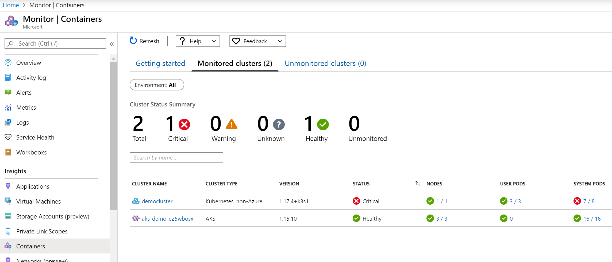
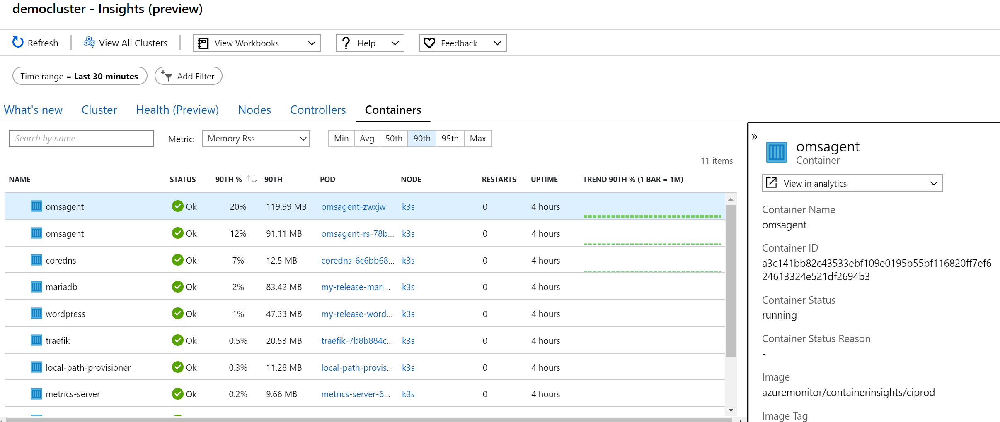
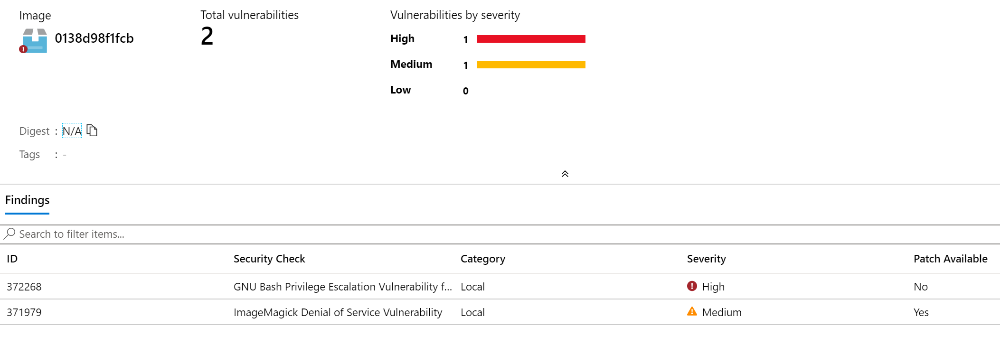

- [Demo environment via GitHub Actions](#demo-environment-via-github-actions)
- [Included compontents](#included-compontents)
- [Demonstrations](#demonstrations)
  - [Monitoring](#monitoring)
    - [Distributed tracing and app telemetry with Application Insights](#distributed-tracing-and-app-telemetry-with-application-insights)
    - [Telemetry](#telemetry)
    - [Logs](#logs)
    - [Azure Monitor for Containers](#azure-monitor-for-containers)
  - [Todo application](#todo-application)
  - [DAPR and KEDA](#dapr-and-keda)
  - [Windows nodes](#windows-nodes)
  - [Linkerd Service Mesh](#linkerd-service-mesh)
  - [Automated canary releasing with Flagger](#automated-canary-releasing-with-flagger)
    - [Flagger using NGINX Ingress and custom application metric](#flagger-using-nginx-ingress-and-custom-application-metric)
      - [Canary](#canary)
      - [A/B](#ab)
    - [Flagger using Linkerd](#flagger-using-linkerd)
    - [Flagger using Istio](#flagger-using-istio)
  - [Security](#security)
    - [Azure Policy](#azure-policy)
    - [Azure Security Center](#azure-security-center)
    - [Azure Active Directory integration](#azure-active-directory-integration)
    - [Managed Identity](#managed-identity)

# Demo environment via GitHub Actions
This demo uses GitHub Actions to orchestrate deployment of infrastructure, application build and applicatio deployment.
1. Terraform is used to deploy AKS cluster (including monitoring, policy engine and AAD integration), Application Gateway (WAF), PostgreSQL as a Service, Key Vault, Service Bus, Event Hub and other infrastructure components. **In main.tf check what variables are needed and store them in your GitHub secrets to fit your environment**
2. AKS and its components (AAD Pod Identity, Application Gateway Ingress controller, Key Vault FlexVolume) are configured for ManagedIdentity (no Service Principal)
3. Helm is used to deploy base AKS cluster components such as Ingress controller for App Gw, DAPR, KEDA, Grafana, Prometheus
4. Azure Container Registry is used to build and package applications
5. DNS record cloud.tomaskubica.in and *.cloud.tomaskubica.in is preconfigured with CNAME pointing to App Gw public IP - only thing that is done outside of Actions. **You need to change this to fit your environment**

# Included compontents
Currently covered
- Azure Kubernetes Service
- Azure Container Registry
- AKS AAD integration with RBAC
- Azure Application Gateway Web Application Firewall as Ingress
- Azure Monitor for Containers including Prometheus scrapper
- Azure Database for PostgreSQL
- Azure Blob Storage
- Azure Service Bus
- Grafana with Azure Monitor datasource
- Prometheus
- Windows nodes
- DAPR
  - State
  - Pub/sub
  - Trigger (input binding) with KEDA scaling
  - Connector (output binding)
  - Secrets API
  - Service-to-service communication
  - OpenTelemetry export to Application Insights
- KEDA
- AAD Pod Identity
- Key Vault FlexVolume
- Linkerd
- Flagger
  - NGINX ingress
- Monitoring -> diagnostic logs
- Azure Monitor for Containers (non-AKS cluster monitoring)

Planned
- Virtual Nodes (after vnet limitations are resolved)
- RUDR and/or Crossplane
- Azure Policy with Gatekeeper v3
- Istio
- Osiris
- Azure CosmosDB
- PSQL managed identity access
- Hybrid -> Azure Arc for Kubernetes
- GitOps
- Flagger
  - with Linker
  - with Istio
- Linkerd telemetry to Application Insights
- OpenTelemetry app demo

# Demonstrations

## Monitoring
Todo application is deployed with traffic generator so we can see some telemetry information in monitoring tools.

### Distributed tracing and app telemetry with Application Insights
Todo application in default namespace is not instrumented with application insights natively in code, but codeless attach is used to still get distributed tracing and telemetry to Application Insights - check appid-blabla workspace in Azure.

Application dapr-demo is instrumented for distributed tracing via DAPR OpenTelemetry export to Application Insights.

### Telemetry
Application does not include Prometheus telemetry, but myappspa is built on nginx container and sidecar adapter has been used to expose NGINX telemetry as Prometheus telemetry. This is gathered to non/persistent Prometheus instance [http://prometheus.cloud.tomaskubica.in](http://prometheus.cloud.tomaskubica.in). Eg. see telemetry with this PromQL:

```
nginx_http_requests_total { app="myapp-spa" }
```

Also Azure Monitor is configured to gather Prometheus telemetry from applications and store it in Azure. Open Logs and see metrics from myappspa using followign Kusto query:

```
InsightsMetrics
| where Namespace == "prometheus"
| where Name == "nginx_http_requests_total"
| extend podName = tostring(parse_json(Tags).pod_name)
| summarize metrics = percentile(Val,95) by bin(TimeGenerated, 5m), podName
| order by TimeGenerated asc
| render timechart 
```

Azure Monitor allows for rich visualizations (Workbooks), deep realtime analytics and machine learning, Alerting capabilities including complex workflows with Logic Apps or analyzing data in Azure Sentinel (SIEM).

Visualizations can be also done in Grafana for both backends - Prometheus and Azure Monitor. Open Grafana at [http://grafana.cloud.tomaskubica.in](http://grafana.cloud.tomaskubica.in) (login is tomas/Azure12345678) and see:
- AKS cluster dashboard (based on data from Azure Monitor)
- Prometheus telemetry for myappspa (based on data from Prometheus backend)
- Prometheus telemetry for myappspa (based on data from Azure Monitor)
- DAPR dashboards
- NGINX Controller dashboard

### Logs
Logs from containers are in following table:

```
ContainerLog 
```

Audit logs from Kubernetes API, Application Gateway, PostgreSQL and other sources.

```
AzureDiagnostics
| where Category == "kube-apiserver"
```

```
AzureDiagnostics
| where Category == "cluster-autoscaler"
```

```
AzureDiagnostics
| where Category == "kube-audit"
```

```
AzureDiagnostics
| where Category == "kube-controller-manager"
```

```
AzureDiagnostics
| where Category == "PostgreSQLLogs"
```

```
AzureDiagnostics
| where Category == "ApplicationGatewayAccessLog"
```

### Azure Monitor for Containers
There is Kubernetes cluster deployed in VM K3s configured with Azure Monitor for Containers agent. Got to Azure Monitor -> Containers and select clusters from all environments (Azure and Non-Azure).





## Todo application
Access todo application at [http://cloud.tomaskubica.in](http://cloud.tomaskubica.in) (Ingress via Application Gateway)

Check monitoring - Application Insights, codeless attach, Prometheus, Grafana, Azure Monitor.

FlexVolume is used to pass PostgreSQL secrets from Key Vault

## DAPR and KEDA
DAPR and KEDA components are deployed in dapr and keda namespaces. KEDA is configured to leverage AAD Pod Identity for authentication to Service Bus. DAPR currently does not offer this for Service Bus component, but AAD pod identity is used for accessing Key Vault secrets.

Store and retrieve state

```bash
kubectl exec -ti nodea-0 -n dapr-demo -- bash /home/user/write.sh
kubectl exec -ti nodeb-0 -n dapr-demo -- bash /home/user/read.sh
```

DAPR is configured to enable messaging between services using Service Bus backend. Connect to nodea-0 and use curl to send message to DAPR. Deployment subscribeorders will receive message. Also look into Service Bus in portal to see subscriber has been created in orders topic.

```bash
kubectl exec -ti nodea-0 -n dapr-demo -- bash /home/user/createorder.sh
kubectl logs -l app=subscribeorders -n dapr-demo -c container
```

Service bindingservicebus is configured with binding to DAPR events from Service Bus queue binding. There is KEDA scaling bounded to this queue so you should not see any Pods running. Go to nodea to generate 20 messages and whats Pods being created to deal with load.

```bash
kubectl exec -ti nodea-0 -n dapr-demo -- python /home/user/sendMessagesToServiceBus.py
```

DAPR provides Blob Storage output binding for nodea. Check it out.

```bash
kubectl exec -ti nodea-0 -n dapr-demo -- bash /home/user/blobout.sh myOutFile.json
```

DAPR Secrets API is configured to point to Azure Key Vault. Use DAPR API to read secrets.

```bash
kubectl exec -ti nodea-0 -n dapr-demo -- bash /home/user/getsecret.sh
```

Service cart comes with /add API call of type POST. You can use DAPR sidecar to call other services.

```bash
kubectl exec -ti nodea-0 -n dapr-demo -- bash /home/user/add.sh
```

Grafana demo install has some Dashboards defined connected to Prometheus. Login is tomas/Azure12345678.
Find it at [http://grafana.cloud.tomaskubica.in](http://grafana.cloud.tomaskubica.in)

Telemetry and logs are also gathered to Azure Monitor.

## Windows nodes
Basic IIS instance is accessible at iis.cloud.tomaskubica.in and runs in windows namespace.

## Linkerd Service Mesh
Todo application is deployed in linkerd-demo namespace and can be accessed at [http://linkerd.cloud.tomaskubica.in](http://linkerd.cloud.tomaskubica.in)

Traffic generator is deployed so we can see some traffic in monitoring.

Checkout Linkerd dashboard (including Grafana) at [http://linkerd.i.cloud.tomaskubica.in](http://linkerd.i.cloud.tomaskubica.in)
Login is tomas/Azure12345678.

Test retry policy. Access service with no retry policy (failRate means % of requests that will cause crash). You will likely see failed responses.

```bash
kubectl exec client-0 -c container -n linkerd-demo -- curl -vs -m 30 retry-service-noprofile?failRate=50
```

Try accessing service with retry policy. Even if container fails Linkerd should hold your connection and retry.

```bash
kubectl exec client-0 -c container -n linkerd-demo -- curl -vs -m 30 retry-service?failRate=50
```

Canary - there are v1 and v2 deployments and services (myweb-service-v1 and myweb-service-v2). Also there is production service myweb-service with TrafficSplit configured for 90% of traffic going to v1. Test it.

```bash
kubectl exec client-0 -c container -n linkerd-demo -- bash -c 'for x in {0..30}; do curl -s myweb-service; echo; done'
```

## Automated canary releasing with Flagger
Flagger supports automated canary releasing with NGINX Ingress, Linkerd Service Mesh, Istio Service Mesh and others.

### Flagger using NGINX Ingress and custom application metric
- Supports canary, green/blue and A/B testing (header based routing)
- Easy to use, very lightweight (no sidecars)
- Does not solve backend service-to-service canary via internal path (must go via Ingress)

Application is exposed at [http://canary.nginx.i.cloud.tomaskubica.in](http://canary.nginx.i.cloud.tomaskubica.in). You should see v1 message and blue background and load-balanced response from multiple instances. Keep window open so traffic is generated.

Should you need to restart this scenario, you can do this:

```bash
helm delete canary -n canary
helm upgrade -i canary ./helm/canary -n canary -f ./helm/canary/values.yaml
```

#### Canary
Check status of Canary release (should be in initialized phase)

```bash
kubectl describe canary canary-nginx -n canary
```

In separate window start generating traffic. 

```bash
while true; do curl http://canary.nginx.i.cloud.tomaskubica.in/version; done
```

Deploy new version, watch Flagger orchestrating process. Application exposes latency metrics which are evaluated by Flagger. Since latency is bellow 500ms we should see Flagger progressing and finaly moving all users to new version.

```bash
helm upgrade -i canary ./helm/canary -n canary --reuse-values \
    --set ingress.canary.imagetag="3\.2\.1"

kubectl describe canary canary-nginx -n canary
```

We will now try next version, but this time simulate long latency. In new window run this:

```bash
while true; do curl http://canary.nginx.i.cloud.tomaskubica.in/delay/3; done
```

Roll new version. Because some calls get routed to delay function metrics for canary version are likely to go worse over time and Flagger should halt advancement and rollback.

```bash
helm upgrade -i canary ./helm/canary -n canary --reuse-values \
    --set ingress.canary.imagetag="3\.2\.2"

kubectl describe canary canary-nginx -n canary
```

#### A/B
In previous example percentage of connections was routed to new release. With A/B scenario we will not do this randomly, but rather decide based on header or cookie. As an example only internal or beta users will get routed to new version to test it out before complete rollout.

Check status of Canary release (should be in initialized phase)

```bash
kubectl describe canary ab-nginx -n canary
```

In separate window start generating traffic. 

```bash
while true; do curl http://ab.nginx.i.cloud.tomaskubica.in/version; done
```

Deploy new version, watch Flagger orchestrating process. In another window start curl using beta tester header to reach new version when deployed.

```bash
while true; do curl -H 'X-Canary: insider' http://ab.nginx.i.cloud.tomaskubica.in/version; done
```

Application exposes latency metrics which are evaluated by Flagger. Since latency is bellow 500ms we should see Flagger progressing and finaly moving all users to new version.

```bash
helm upgrade -i canary ./helm/canary -n canary --reuse-values --set ingress.ab.imagetag="3\.2\.1"

kubectl describe canary ab-nginx -n canary
```

We will now try next version, but this time simulate long latency. In new window run this:

```bash
while true; do curl -H 'X-Canary: insider' http://ab.nginx.i.cloud.tomaskubica.in/delay/3; done
```

Roll new version. Because some calls get routed to delay function metrics for canary version are likely to go worse over time and Flagger should halt advancement and rollback.

```bash
helm upgrade -i canary ./helm/canary -n canary --reuse-values --set ingress.ab.imagetag="3\.2\.2"

kubectl describe canary ab-nginx -n canary
```

### Flagger using Linkerd
- Supports canary, green/blue
- Does not support A/B testing (header based routing)
- Dependency on Linkerd (sidecars), more overhead
- Supports internal service-to-service traffic

TBD

### Flagger using Istio
- Supports canary, green/blue, A/B testing (header based routing) and mirroring
- Dependency on Istio (sidecars), significant overhead
- Supports internal service-to-service traffic

TBD

## Security
### Azure Policy
**Work in progress**

AKS resource group is configured with Azure Policy (ARM is using connector for Gatekeeper v3) with exceptions for most namespaces except namespace "policy". 6 policies are configured:
- No public IP on load balancer
- Must include label release-type
- Ingress must be HTTPS (no HTTP)
- Only container repos with azurecr.io in name are allowed (no Docker Hub)
- Must include limits on resources, but never more than 200m and 128Mi
- No privileged containers

### Azure Security Center
Go to Azure Security Center to see found issues in our AKS cluster and Azure Container Registry vulnerabilities in images (powered by Qualys).




### Azure Active Directory integration 
Check AAD integration for Kubernetes users

```bash
rm ~/.kube/config
az aks get-credentials -n tomasdemoaks-test -g aks-test
kubectl get nodes   # login as admin@tomaskubicaoffice.onmicrosoft.com
```

### Managed Identity
This demo is extensively using concept of Managed Identity so applications can securely access secrets and resources without need to handover passwords.

AAD Pod Identity is used to bring managed identity to AKS on per-Pod basis with AzureIdentity and AzureIdentityBinding CRDs. This how to get short-lived token and use it to access Key Vault.

```bash
# Get Pod name
nodepod=$(kubectl get pods -l app=myapp-node -o name | head -n 1)

# Get Key Vault name
terraform output keyvault_name

# Use managed identity
kubectl exec -ti $nodepod -- bash 
  # Get token
  curl -s "http://169.254.169.254/metadata/identity/oauth2/token?resource=https://vault.azure.net"
  # Parse and store token
  export token=$(curl -s http://169.254.169.254/metadata/identity/oauth2/token?resource=https://vault.azure.net | jq -r '.access_token')
  # Access Key Vault with token
  keyvault=vault-demo-e25wbosx
  curl -H "Authorization: Bearer ${token}" https://$keyvault.vault.azure.net/secrets/psql-jdbc?api-version=7.0
```

Azure Key Vault FlexVolume is used to pass Key Vault secrets as files. On backend it is using Managed Identity, but application does not need to ask for token, secret is mapped to its file system directly.

```bash
# Get Pod name
todopod=$(kubectl get pods -l app=myapp-todo -o name | head -n 1)
kubectl exec -ti $todopod -- bash -c 'ls -lah /keyvault; cat /keyvault/psql-jdbc'
```

Some components deployed in this demo also access Azure resources via Managed Identity:
- Azure Monitor
- FlexVolume
- AAD Pod Identity (it needs to talk to Azure and is using managed identity for that)
- Kubernetes itself
- KEDA autoscaler
- Application Gateway Ingress Controller

Some components are using standard passwords/connection_strings until managed identity is supported. This includes:
- Some DAPR components
- PostgreSQL connection